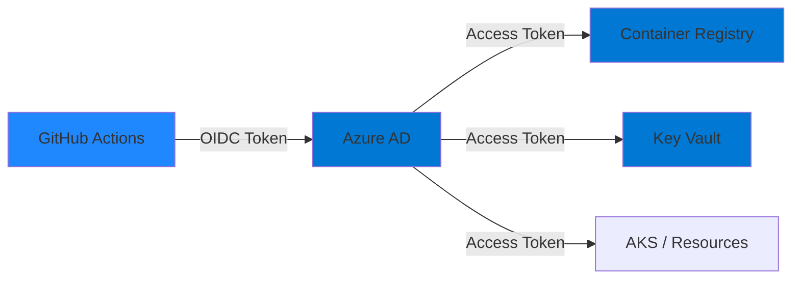

# Azure Platform Activation - Detailed Guide

This guide provides comprehensive, step-by-step instructions for activating the CI/CD platform with Azure infrastructure.

## Overview

**Goal:** Transform the dormant platform into a fully operational CI/CD environment by provisioning Azure resources and configuring GitHub Actions to authenticate via OIDC.

**Time Required:** 30-60 minutes (first-time setup)

**Cost:** ~$5-10/month for Azure resources

## Architecture Refresher



**Key Principle:** Zero static credentials. GitHub Actions authenticates using short-lived OIDC tokens, eliminating secrets management.

## Phase 1: Azure Account Preparation

### Step 1.1: Verify Azure Access

```bash
# Login to Azure
az login

# Verify subscription
az account show

# List available subscriptions
az account list --output table

# Set active subscription (if needed)
az account set --subscription "your-subscription-id"
```

**Capture:** Note your subscription ID for later use.

### Step 1.2: Verify Permissions

Your Azure account must have:
- **Contributor** role on the subscription (or resource group)
- **User Access Administrator** (for role assignments)
- Permissions to create Azure AD applications

Verify:
```bash
# Check role assignments
az role assignment list --assignee $(az account show --query user.name -o tsv) --output table
```

### Step 1.3: Choose Azure Region

Select a region close to your users:
- `eastus` - East US
- `westus2` - West US 2
- `centralus` - Central US
- `westeurope` - West Europe
- `uksouth` - UK South

List all regions:
```bash
az account list-locations --query "[].name" -o table
```

## Phase 2: Terraform Configuration

### Step 2.1: Navigate to Infrastructure Directory

```bash
cd infra/terraform
```

### Step 2.2: Create Configuration File

Copy the example:
```bash
cp terraform.tfvars.example terraform.tfvars
```

### Step 2.3: Edit Configuration

Open `terraform.tfvars` and configure:

```hcl
# ============================================================================
# REQUIRED: Azure Configuration
# ============================================================================

# Your Azure subscription ID (from Step 1.1)
azure_subscription_id = "00000000-0000-0000-0000-000000000000"

# Azure region (from Step 1.3)
azure_location = "eastus"

# ============================================================================
# OPTIONAL: Customize Resource Names
# ============================================================================

# Prefix for all resources (3-10 lowercase alphanumeric)
resource_prefix = "cicdplatform"

# Resource group name
resource_group_name = "cicd-platform-rg"

# Environment
environment = "dev"

# ============================================================================
# GitHub OIDC Configuration
# ============================================================================

# Your GitHub username or organization
github_organization = "your-github-username"

# Repository name (without org prefix)
github_repository = "cloud-platform-cicd-automation"

# OIDC branch filter (* = any branch)
github_branch = "main"

# OIDC environment filter (* = any environment)
github_environment = "*"

# ============================================================================
# Service SKUs (Optional)
# ============================================================================

# ACR SKU: Basic (~$5/mo), Standard (~$20/mo), Premium (~$50/mo)
acr_sku = "Basic"

# Key Vault SKU: standard or premium
key_vault_sku = "standard"
```

**Important:** 
- `github_organization` and `github_repository` must match your actual repository
- `github_environment` = `"*"` allows any environment; use `"production"` to restrict to specific environments

### Step 2.4: Validate Configuration

```bash
# Check syntax
cat terraform.tfvars

# Verify no placeholder values remain
grep -E "your-|00000000-0000" terraform.tfvars
```

## Phase 3: Provision Azure Infrastructure

### Step 3.1: Initialize Terraform

```bash
terraform init
```

**Expected output:**
```
Initializing provider plugins...
- Finding hashicorp/azurerm versions matching "~> 3.0"...
- Finding hashicorp/azuread versions matching "~> 2.0"...
...
Terraform has been successfully initialized!
```

### Step 3.2: Review Execution Plan

```bash
terraform plan
```

**Review carefully:**
- Resources to be created (should show ~8-10 resources)
- Resource names match your `resource_prefix`
- OIDC subject claim matches your repository

**Example output:**
```
Plan: 10 to add, 0 to change, 0 to destroy.

Changes to Outputs:
  + acr_login_server    = "cicdplatformacr4j8k2m.azurecr.io"
  + azure_client_id     = (known after apply)
  + key_vault_name      = "cicdplatform-kv-8n3p1x"
```

### Step 3.3: Apply Configuration

```bash
terraform apply
```

Type `yes` when prompted.

**Duration:** 2-5 minutes

**Expected output:**
```
Apply complete! Resources: 10 added, 0 changed, 0 destroyed.

Outputs:
acr_login_server = "cicdplatformacr4j8k2m.azurecr.io"
acr_name = "cicdplatformacr4j8k2m"
azure_client_id = "33333333-3333-3333-3333-333333333333"
azure_subscription_id = "22222222-2222-2222-2222-222222222222"
azure_tenant_id = "11111111-1111-1111-1111-111111111111"
key_vault_name = "cicdplatform-kv-8n3p1x"
key_vault_uri = "https://cicdplatform-kv-8n3p1x.vault.azure.net/"
resource_group_name = "cicd-platform-rg"
```

### Step 3.4: Capture Outputs

Save outputs to a file for reference:
```bash
terraform output -json > outputs.json
```

Or display in readable format:
```bash
terraform output
```

**CRITICAL:** Keep these values. You'll need them for GitHub configuration.

## Phase 4: Configure GitHub Secrets

### Step 4.1: Navigate to GitHub Repository Settings

1. Open your repository in a browser
2. Go to **Settings** tab
3. Click **Secrets and variables** → **Actions**
4. Click **New repository secret**

### Step 4.2: Add Required Secrets

Add each of the following secrets:

#### Secret 1: AZURE_CLIENT_ID
- **Name:** `AZURE_CLIENT_ID`
- **Value:** ` from `terraform output azure_client_id`
- **Purpose:** Public identifier for Azure AD application (not actually secret, but stored as secret for convenience)

#### Secret 2: AZURE_TENANT_ID
- **Name:** `AZURE_TENANT_ID`
- **Value:** From `terraform output azure_tenant_id`
- **Purpose:** Azure AD tenant identifier

#### Secret 3: AZURE_SUBSCRIPTION_ID
- **Name:** `AZURE_SUBSCRIPTION_ID`
- **Value:** From `terraform output azure_subscription_id`
- **Purpose:** Azure subscription identifier

#### Secret 4: ACR_LOGIN_SERVER
- **Name:** `ACR_LOGIN_SERVER`
- **Value:** From `terraform output acr_login_server`
- **Purpose:** Container Registry URL (e.g., `cicdplatformacr4j8k2m.azurecr.io`)

#### Secret 5: ACR_NAME
- **Name:** `ACR_NAME`
- **Value:** From `terraform output acr_name`
- **Purpose:** Container Registry name (e.g., `cicdplatformacr4j8k2m`)

#### Secret 6: KEY_VAULT_NAME
- **Name:** `KEY_VAULT_NAME`
- **Value:** From `terraform output key_vault_name`
- **Purpose:** Key Vault name (e.g., `cicdplatform-kv-8n3p1x`)

### Step 4.3: Verify All Secrets Are Configured

You should see 6 secrets:
- ✅ AZURE_CLIENT_ID
- ✅ AZURE_TENANT_ID
- ✅ AZURE_SUBSCRIPTION_ID
- ✅ ACR_LOGIN_SERVER
- ✅ ACR_NAME
- ✅ KEY_VAULT_NAME

## Phase 5: Test Activation

### Step 5.1: Trigger Workflow

**Option A: Push a commit**
```bash
git commit --allow-empty -m "Test platform activation"
git push
```

**Option B: Manual trigger** (if workflow_dispatch is configured)
- Go to **Actions** tab
- Select workflow
- Click **Run workflow**

### Step 5.2: Monitor Pre-Flight Job

Watch the `azure-preflight` job:

**Expected output:**
```
============================================
AZURE ACTIVATION PRE-FLIGHT CHECK
============================================

Checking required Azure configuration...

✅ AZURE_CLIENT_ID is configured
✅ AZURE_TENANT_ID is configured
✅ AZURE_SUBSCRIPTION_ID is configured

============================================
✅ AZURE CONFIGURATION PRESENT
============================================

Proceeding with OIDC authentication validation...

============================================
✅ AZURE OIDC AUTHENTICATION SUCCESSFUL
============================================

Successfully authenticated to Azure using OIDC federation.
No static credentials were used.

✅ ACR authentication successful
✅ Key Vault access successful

============================================
AZURE PRE-FLIGHT SUMMARY
============================================

Authentication: success
ACR Access: success
Key Vault Access: success

✅ Platform is ACTIVATED and ready for CI/CD operations
```

### Step 5.3: Verify Workflow Completion

All jobs should complete successfully:
- ✅ validate-inputs
- ✅ azure-preflight
- ✅ validate
- ✅ security-enforcement
- ✅ build
- ✅ test
- ✅ scan
- ✅ deploy-dev (if applicable)

## Phase 6: Validation

### Step 6.1: Verify Azure AD Federation

Azure Portal → **Azure Active Directory** → **App registrations** → [your app]

Check **Federated credentials**:
- Issuer: `https://token.actions.githubusercontent.com`
- Subject: `repo:your-org/your-repo:environment:*` (or branch pattern)
- Audience: `api://AzureADTokenExchange`

### Step 6.2: Verify ACR

```bash
# Login using Azure CLI
az acr login --name $(terraform output -raw acr_name)

# List repositories (should be empty initially)
az acr repository list --name $(terraform output -raw acr_name)
```

### Step 6.3: Verify Key Vault

```bash
# List secrets (should be empty or minimal initially)
az keyvault secret list --vault-name $(terraform output -raw key_vault_name)
```

### Step 6.4: Verify RBAC Assignments

```bash
# Check ACR role assignments
az role assignment list --scope $(terraform output -raw acr_id) --output table

# Check Key Vault role assignments
az role assignment list --scope $(terraform output -raw key_vault_id) --output table
```

Expected roles:
- Service principal → ACR: `AcrPush`
- Service principal → Key Vault: `Key Vault Secrets User`

## Troubleshooting

### Issue: terraform apply fails with "Unauthorized"

**Cause:** Insufficient Azure permissions  
**Solution:**
```bash
# Check your role assignments
az role assignment list --assignee $(az account show --query user.name -o tsv)

# You need: Contributor + User Access Administrator
# Or: Owner
```

---

### Issue: OIDC authentication fails in GitHub Actions

**Cause:** Subject claim mismatch  
**Solution:**
1. Check federated credential subject in Azure Portal
2. Verify it matches your repository: `repo:org/repo:environment:*`
3. Ensure repository name matches exactly (case-sensitive)

---

### Issue: "ACR access denied" in pre-flight

**Cause:** RBAC propagation delay  
**Solution:** Wait 5-10 minutes, then re-run workflow

---

### Issue: terraform.tfvars not found

**Cause:** File not created or wrong directory  
**Solution:**
```bash
pwd  # Should show: .../infra/terraform
ls -la terraform.tfvars
# If missing: cp terraform.tfvars.example terraform.tfvars
```

## Next Steps

After successful activation:

1. **Deploy a Service** - Create a consumer repository using this platform
2. **Test Full Flow** - Build → Test → Deploy → Promote
3. **Configure Environments** - Set up GitHub environment protection rules
4. **Add Secrets to Key Vault** - Store application secrets
5. **Monitor Costs** - Azure Portal → Cost Management

## Maintenance

### Update Infrastructure

```bash
cd infra/terraform

# Make changes to .tf files or terraform.tfvars
nano main.tf

# Preview changes
terraform plan

# Apply changes
terraform apply
```

### View Current State

```bash
# Show all resources
terraform show

# Show specific output
terraform output acr_login_server

# Show state list
terraform state list
```

### Teardown (Deactivation)

To completely remove all Azure resources:

```bash
cd infra/terraform
terraform destroy
```

**Warning:** This deletes all resources including ACR (with images) and Key Vault.

## Support & Documentation

- **Platform Docs:** [docs/](../../docs/)
- **Infrastructure:** [infra/README.md](../../infra/README.md)
- **Security Model:** [docs/security/](../../docs/security/)
- **Promotion Model:** [docs/promotion/](../../docs/promotion/)

---

**Platform Status:** Activation-ready  
**Documentation:** Complete  
**Support:** Self-service via documentation

This platform is designed to activate with zero code changes after completing this guide.
