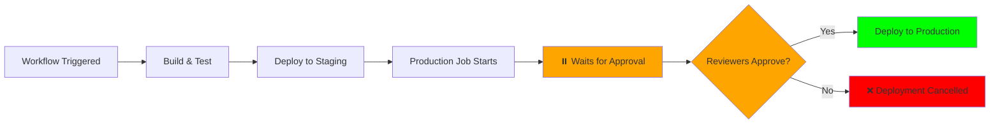

# GitHub Environments Setup

The workflow currently has environment protection **commented out** because GitHub environments don't exist in the repository yet.

## Why Environments Are Commented Out

GitHub Actions workflow validation requires that referenced environments exist in the repository settings. Since we haven't created them yet, the references are commented out to prevent workflow errors.

## When to Create Environments

Create GitHub environments **after Azure activation** when you're ready to add deployment protection rules.

## How to Create GitHub Environments

### Step 1: Navigate to Repository Settings

1. Go to your repository on GitHub
2. Click **Settings** tab
3. Click **Environments** in the left sidebar
4. Click **New environment**

### Step 2: Create Each Environment

Create these three environments:

#### Development Environment
- **Name:** `development`
- **Deployment branches:** All branches (or specify `feature/*`, `bugfix/*`)
- **Protection rules:** None required (auto-deploy)
- **Environment URL:** `https://dev.example.com` (update with your actual dev URL)

#### Staging Environment
- **Name:** `staging`
- **Deployment branches:** `main`, `release/*`
- **Protection rules:** 
  - Wait timer: 0 minutes
  - Optional: Required reviewers (1 person)
- **Environment URL:** `https://staging.example.com` (update with actual staging URL)

#### Production Environment (CRITICAL)
- **Name:** `production`
- **Deployment branches:** `main`, `release/*`, `hotfix/*` only
- **Protection rules:**
  - **Required reviewers:** 2+ team members
  - **Wait timer:** 5-10 minutes (gives time to cancel if needed)
  - **Prevent self-review:** Enabled
- **Environment URL:** `https://prod.example.com` (update with actual production URL)
- **Environment secrets:** Add production-specific secrets here if needed

### Step 3: Uncomment Environment References in Workflow

Once environments are created, edit `.github/workflows/cicd-platform.yml`:

**For Development (around line 883):**
```yaml
# Currently:
# environment:
#   name: development
#   url: https://dev.example.com

# Change to:
environment:
  name: development
  url: https://dev.example.com  # Update with actual URL
```

**For Staging (around line 933):**
```yaml
# Currently:
# environment:
#   name: staging
#   url: https://staging.example.com

# Change to:
environment:
  name: staging
  url: https://staging.example.com  # Update with actual URL
```

**For Production (around line 972):**
```yaml
# Currently:
# environment:
#   name: production
#   url: https://prod.example.com

# Change to:
environment:
  name: production
  url: https://prod.example.com  # Update with actual URL
```

## Benefits of GitHub Environments

Once enabled, environments provide:

### Security
- **Required reviewers** prevent accidental production deployments
- **Deployment branches** restrict which branches can deploy where
- **Wait timers** allow last-minute cancellation

### Visibility
- **Deployment history** per environment in GitHub UI
- **Protection status** shows who approved deployments
- **Environment URLs** link directly from workflow runs

### Compliance
- **Audit trail** of who approved production deployments
- **Separation of duties** via required reviewers
- **Branch restrictions** enforce promotion model

## Workflow Impact

### Without Environments (Current State)
- ✅ Workflows run successfully
- ✅ Deployment jobs execute (if conditions met)
- ❌ No manual approval gates
- ❌ No deployment history in UI
- ❌ No branch restrictions enforced by GitHub

### With Environments Enabled
- ✅ Workflows run successfully
- ✅ Deployment jobs execute (if conditions met)
- ✅ **Manual approval required for production**
- ✅ **Deployment history tracked in GitHub UI**
- ✅ **Branch restrictions enforced automatically**

## Recommended Timeline

1. **Now (Day 11):** Environments commented out, workflows functional
2. **Day 12 (Demo):** Run workflows without environment protection
3. **Post-Demo:** Create environments and uncomment references
4. **Production:** Always use environment protection for production deployments

## Production Deployment Approval Flow

Once production environment is configured with required reviewers:



## Quick Reference

| Environment | Required Reviewers | Branch Restrictions | Purpose |
|-------------|-------------------|-------------------|---------|
| `development` | 0 | All branches | Fast feedback loop |
| `staging` | 0-1 (optional) | `main`, `release/*` | Pre-production testing |
| `production` | 2+ (required) | `main`, `release/*`, `hotfix/*` | User-facing deployments |

---

**Current Status:** Environments not created yet (workflows still functional)  
**Next Action:** Create environments after Azure activation  
**Reference:** [GitHub Docs - Using environments for deployment](https://docs.github.com/en/actions/deployment/targeting-different-environments/using-environments-for-deployment)
