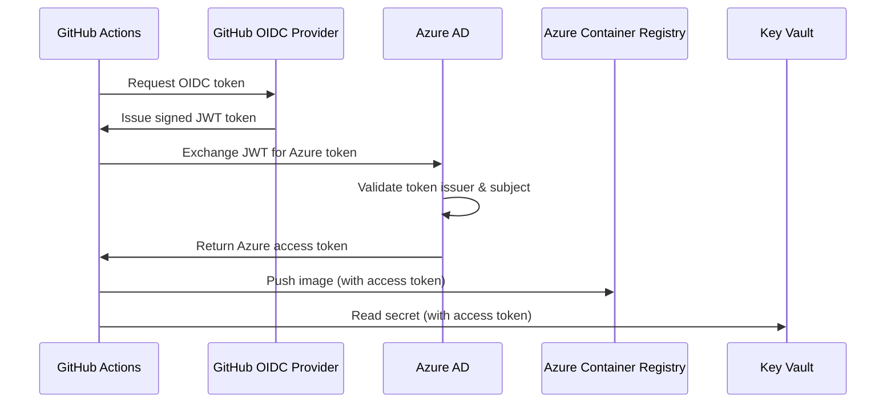

# CI/CD Platform Infrastructure

This directory contains Terraform configuration for provisioning the Azure infrastructure required by the CI/CD platform.

## What This Infrastructure Manages

This Terraform configuration provisions and manages:

1. **Azure AD Application & Service Principal** - Identity for GitHub Actions
2. **OIDC Federated Identity Credential** - Passwordless authentication from GitHub
3. **Azure Container Registry (ACR)** - Storage for container images
4. **Azure Key Vault** - Secure secrets management
5. **RBAC Role Assignments** - Minimal permissions for CI/CD operations

## Architecture: Zero Static Credentials

### How GitHub Actions Authenticates

This infrastructure implements **OpenID Connect (OIDC) federation** between GitHub Actions and Azure:



### Why No Secrets Are Used

**Traditional approach (❌ NOT USED):**
- Create service principal
- Generate client secret/password
- Store in GitHub Secrets
- Credential rotation required
- Secret leakage risk

**OIDC approach (✅ IMPLEMENTED):**
- No passwords or secrets
- GitHub issues short-lived OIDC tokens
- Azure validates token claims (issuer, subject, audience)
- Token maps to Azure AD application via federated credential
- Automatic rotation, zero credential management

**Subject claim pattern:**
```
repo:nikhilgummadavelli8/cloud-platform-cicd-automation:environment:production
```

Azure trusts GitHub's OIDC provider and validates:
- **Issuer**: `https://token.actions.githubusercontent.com`
- **Audience**: `api://AzureADTokenExchange`
- **Subject**: Matches repository + environment/branch

## Security Model

### Access Control

| Resource | Identity | Role | Scope | Purpose |
|----------|----------|------|-------|---------|
| ACR | GitHub Actions SP | `AcrPush` | ACR resource | Push/pull container images |
| Key Vault | GitHub Actions SP | `Key Vault Secrets User` | Key Vault resource | Read secrets only |
| Resource Group | GitHub Actions SP | `Contributor` | Resource group | Deploy/manage resources |

### Key Security Features

1. **Identity-Based Access**
   - ACR admin user explicitly disabled
   - Key Vault uses RBAC (not legacy access policies)
   - No username/password authentication

2. **Least Privilege**
   - Roles scoped to resource level (not subscription-wide)
   - Read-only Key Vault access
   - No unnecessary permissions

3. **Production Hardening** (optional, configured via variables)
   - Key Vault purge protection
   - Network rules for restricted access
   - Soft delete enabled

## How to Use This Infrastructure

### Prerequisites

1. **Azure Account** with active subscription
2. **Azure CLI** installed and authenticated (`az login`)
3. **Terraform** >= 1.6 installed
4. **Appropriate Azure permissions** to create:
   - Azure AD applications
   - Resource groups
   - ACR, Key Vault
   - Role assignments

### Step 1: Configure Variables

Create a `terraform.tfvars` file:

```hcl
azure_subscription_id = "your-subscription-id"
azure_location        = "eastus"
resource_prefix       = "cicdplatform"
environment           = "dev"

github_organization = "nikhilgummadavelli8"
github_repository   = "cloud-platform-cicd-automation"
github_branch       = "main"         # or "*" for any branch
github_environment  = "production"   # or "*" for any environment
```

**Alternative:** Set via environment variables:
```bash
export TF_VAR_azure_subscription_id="your-subscription-id"
export TF_VAR_azure_location="eastus"
# ... etc
```

### Step 2: Initialize Terraform

```bash
cd infra/terraform
terraform init
```

This downloads required providers (azurerm, azuread, random).

### Step 3: Review the Plan

```bash
terraform plan
```

Review all resources that will be created. Ensure:
- Resource names are acceptable
- OIDC subject claim matches your GitHub setup
- Costs are within budget (ACR Basic ~$5/month)

### Step 4: Apply Configuration

```bash
terraform apply
```

Type `yes` to confirm and create resources.

### Step 5: Capture Outputs

```bash
terraform output
```

You'll need these values for GitHub Actions:
- `azure_client_id` - Store as GitHub secret `AZURE_CLIENT_ID`
- `azure_tenant_id` - Store as GitHub secret `AZURE_TENANT_ID`
- `azure_subscription_id` - Store as GitHub secret `AZURE_SUBSCRIPTION_ID`
- `acr_login_server` - Use in workflows to push images
- `key_vault_name` - Use to read secrets

## Integration with CI/CD

### GitHub Actions Workflow Configuration

Add these repository secrets in GitHub:
- Settings → Secrets and variables → Actions → New repository secret

```yaml
# .github/workflows/your-workflow.yml
name: CI/CD with Azure OIDC

on:
  push:
    branches: [main]

permissions:
  id-token: write  # Required for OIDC token request
  contents: read

jobs:
  build-and-push:
    runs-on: ubuntu-latest
    steps:
      - uses: actions/checkout@v4
      
      - name: Azure Login via OIDC
        uses: azure/login@v1
        with:
          client-id: ${{ secrets.AZURE_CLIENT_ID }}
          tenant-id: ${{ secrets.AZURE_TENANT_ID }}
          subscription-id: ${{ secrets.AZURE_SUBSCRIPTION_ID }}
      
      - name: Login to ACR
        run: |
          az acr login --name ${{ secrets.ACR_NAME }}
      
      - name: Build and Push Docker Image
        run: |
          docker build -t ${{ secrets.ACR_LOGIN_SERVER }}/app:${{ github.sha }} .
          docker push ${{ secrets.ACR_LOGIN_SERVER }}/app:${{ github.sha }}
      
      - name: Read Secret from Key Vault
        run: |
          az keyvault secret show --vault-name ${{ secrets.KEY_VAULT_NAME }} --name my-secret
```

## Connection to Platform Architecture

This infrastructure directly implements patterns from:

- **[Security Model](../docs/security/secrets-management.md)** - OIDC authentication, Key Vault integration
- **[Artifact Standards](../docs/artifacts/artifact-standards.md)** - ACR as artifact repository
- **[Promotion Flow](../docs/promotion/README.md)** - Environment-based OIDC federation
- **[Audit Trail](../docs/observability/audit-and-run-artifacts.md)** - Identity-based operations are fully logged

## State Management

**Current Setup:** Local state file (`terraform.tfstate`)

**Production Recommendation:** Use remote backend in Azure Storage:

1. Create storage account for Terraform state
2. Uncomment backend configuration in `versions.tf`
3. Run `terraform init -migrate-state`

This enables:
- Team collaboration
- State locking
- Disaster recovery

## Resource Naming

Resources follow this pattern:
- ACR: `<prefix>acr<random>` (e.g., `cicdplatformacr4j8k2m`)
- Key Vault: `<prefix>-kv-<random>` (e.g., `cicdplatform-kv-8n3p1x`)
- Resource Group: `<resource_group_name>` variable
- AD Application: `<prefix>-github-actions`

Random suffixes ensure global uniqueness for ACR and Key Vault.

## Costs

Approximate monthly costs (East US, as of 2026):
- **Container Registry (Basic)**: ~$5/month
- **Key Vault**: $0.03 per 10,000 operations (minimal)
- **Azure AD**: Free for basic usage
- **Storage (if using remote state)**: ~$0.05/month

**Total: ~$5-10/month**

## Troubleshooting

### OIDC Authentication Fails

**Error:** `AADSTS700016: Application not found`

**Solution:** Verify `AZURE_CLIENT_ID` matches Terraform output

---

**Error:** `AADSTS70021: No matching federated identity record found`

**Solution:** Check OIDC subject claim:
- Environment name matches (e.g., `production`)
- Branch name matches (e.g., `main`)
- Repository name is correct

---

### ACR Access Denied

**Error:** `unauthorized: authentication required`

**Solution:** Ensure:
1. Azure login succeeded (`az account show`)
2. Service principal has `AcrPush` role
3. Using `az acr login` before Docker operations

---

### Key Vault Access Denied

**Error:** `Forbidden: The user, group or application does not have secrets get permission`

**Solution:** Verify:
1. Key Vault uses RBAC authorization
2. Service principal has `Key Vault Secrets User` role
3. RBAC assignments have propagated (wait 5-10 minutes)

## Next Steps

After deploying this infrastructure:

1. **Configure GitHub Secrets** with Terraform outputs
2. **Update workflows** to use Azure OIDC login
3. **Test ACR push/pull** in a workflow
4. **Store secrets** in Key Vault
5. **Enable environment protection** in GitHub for production

## Maintenance

- **Review role assignments** quarterly
- **Audit Key Vault access logs** regularly
- **Keep Terraform providers updated** annually
- **Rotate nothing** - OIDC handles it automatically

---

**Questions or issues?** This infrastructure is designed to be interview-ready and production-capable. All patterns follow Azure best practices for CI/CD security.
